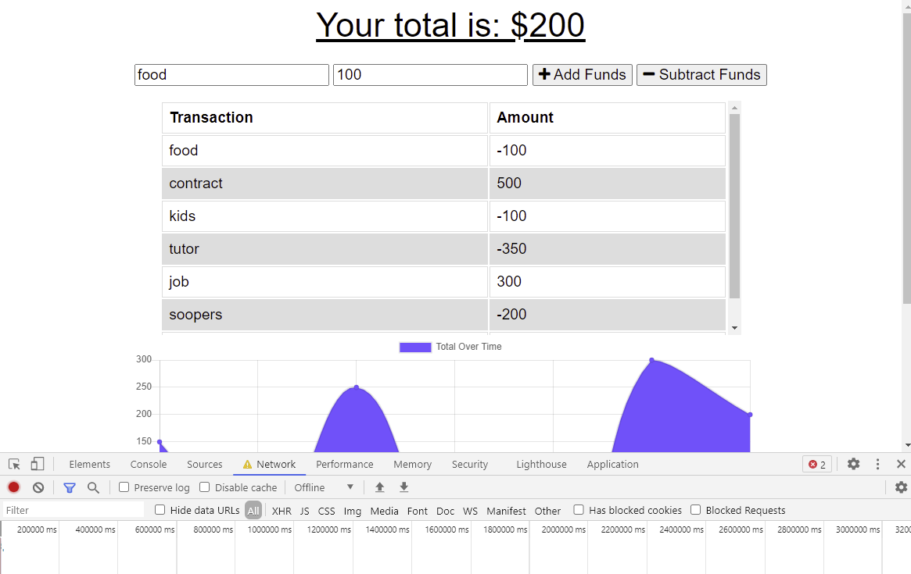

## Offline Budget Tracker

License Badge: MIT Copyright (c) [2021] [Blair Taylor]

## [Description](#description)

## [Installation](#installation)

## [Usage](#usage)

## [Contributing](#contribute)

## [Tests](#tests)

## Description

Complete code for functionality for an offline budget tracker. Th euser will be able to log deposits and expenses and amounts for their budget with or without an internet connection. Account balnace is accurate offline and online. Files updates are: service.worker, manifest.webmanifest and db.js functionality.

## Installation

It is deployed on Heroku or link in GitHub.
[Lets go to GitHub](https://blairntaylor.github.io/budget-tracker/)
[Lets go to Heroku]()

## Usage

Open GitHub and Heroku and follow instructions online entering value and viewing balance.

## Contributing

Email developer

## Tests

Email developer

## Screenshot

## License

This project is licensed to: MIT Copyright (c) [2021] [Blair Taylor]

## Questions

GitHub username: blairntaylor
Email address: [blairntaylor@gmail.com](mailto:blairntaylor@gmail.com)
